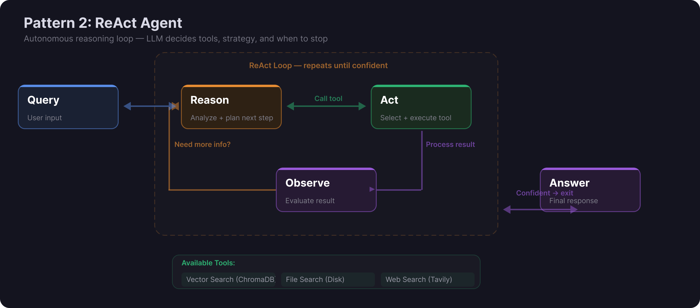

# Agentic RAG - ReAct Agent

A ReAct (Reason + Act) agent that autonomously decides which retrieval tool to use per query. Built with LlamaIndex and powered by AWS Bedrock Claude.

Unlike traditional RAG (which always runs the same pipeline), this agent **reasons about each query** and picks the best retrieval strategy at runtime.

## Key Highlights

- **ReAct Pattern** -- Autonomous Reason-Act-Observe loop. The LLM drives tool selection, not hardcoded logic.
- **4 Agent Tools** -- Vector search, file search, file read, and web search with priority-based selection.
- **MCP Server** -- Exposes ChromaDB to external clients via stdio (Claude Desktop) and SSE (web).
- **Live Reasoning Traces** -- Streamlit UI shows every tool call and result in real time as the agent thinks.
- **AgentWorkflow API** -- Built on LlamaIndex's latest workflow-based agent, not the deprecated ReActAgent class.
- **Local Embeddings** -- nomic-embed-text-v1.5 runs locally despite using Bedrock for inference. Zero embedding cost.



## How the Agent Thinks

The system prompt encodes a **priority-ordered tool selection strategy**: try vector search first (semantic understanding), fall back to file search (exact terms), use file read for full context, and only hit the web as a last resort. The prompt includes a hard rule: **never answer from LLM knowledge alone**. Every response must be grounded in tool results.

This means the agent self-corrects. If vector search returns low-relevance results, the agent reasons that it needs a different approach and switches tools. If the first tool call is insufficient, it loops again.

## Tools

| Tool | What It Does | Best For |
|------|-------------|----------|
| `vector_search` | Semantic search over ChromaDB. Returns **synthesized answers** via LlamaIndex query engine (not raw chunks). | Conceptual questions about document content |
| `file_search` | Regex grep across .txt/.docx files. Case-insensitive, capped at 20 matches. | Exact terms, names, numbers |
| `file_read` | Read full file content by name. Truncated at 8,000 chars. Bypasses chunking entirely. | Getting complete document context |
| `web_search` | Tavily API web search. Up to 5 results. Graceful degradation if no API key. | Current events, real-time data |

## Two Access Paths

The knowledge base is accessible through two fundamentally different paths:

**ReAct Agent** (Streamlit UI / CLI): The agent reasons about the query, selects tools, and `vector_search` returns synthesized answers via LlamaIndex's query engine. The LLM processes retrieved chunks before the agent sees them.

**MCP Server** (Claude Desktop / any MCP client): Direct ChromaDB access returning raw chunks with similarity scores. No agent reasoning, no synthesis. Supports both stdio and SSE transport.

## Quick Start

### 1. Install dependencies

```bash
pip install -r requirements.txt
```

### 2. Configure environment

```bash
cp .env.example .env
# Edit .env with your AWS credentials and Tavily API key
```

### 3. Ingest documents

Place documents (.pdf, .txt, .docx) in the `data/` directory, then:

```bash
python ingest.py
```

### 4. Run the agent

**Streamlit UI:**
```bash
streamlit run app.py
```

**CLI:**
```bash
python main.py
```

**MCP Server (for Claude Desktop):**
```bash
python mcp_server.py
```

## MCP Server

The MCP server exposes the ChromaDB knowledge base as tools that any MCP client can use:

- `search_documents` - Semantic vector search (returns chunks with similarity scores)
- `list_documents` - List all ingested documents with chunk counts

Supports **dual transport**: stdio (for Claude Desktop) and SSE (for web clients, via `--sse` flag).

### Connect Claude Desktop

Add to your Claude Desktop config (`%APPDATA%\Claude\claude_desktop_config.json`):

```json
{
  "mcpServers": {
    "agentic-rag-knowledge-base": {
      "command": "python",
      "args": ["/path/to/agentic-rag-react/mcp_server.py"]
    }
  }
}
```

## Docker

```bash
docker compose up --build
# Open http://localhost:8501
```

## Project Structure

```
agentic-rag-react/
├── app.py                 # Streamlit UI with reasoning trace sidebar
├── main.py                # CLI entry point
├── agent.py               # ReAct agent setup (AgentWorkflow API)
├── ingest.py              # Document ingestion (SentenceSplitter, 512 chunk size)
├── config.py              # Pydantic Settings configuration
├── mcp_server.py          # MCP server (stdio + SSE)
├── tools/
│   ├── vector_search.py   # ChromaDB query engine (synthesized answers)
│   ├── file_search.py     # File grep + full read
│   └── web_search.py      # Tavily web search
├── data/                  # Documents to ingest
├── chroma_db/             # Vector store (auto-generated)
├── Dockerfile
└── docker-compose.yml
```

## Tech Stack

- **Agent Framework:** LlamaIndex AgentWorkflow (v0.14)
- **LLM:** AWS Bedrock Claude Haiku (Converse API, async streaming)
- **Embeddings:** HuggingFace nomic-embed-text-v1.5 (local, 768d)
- **Vector Store:** ChromaDB (persistent, similarity_top_k=5)
- **Web Search:** Tavily
- **MCP:** Model Context Protocol SDK (FastMCP, stdio + SSE)
- **UI:** Streamlit with real-time reasoning traces

## Part of the RAG Portfolio

| Repo | Pattern | Focus |
|------|---------|-------|
| [VaultRAG](https://github.com/prsaurabh/VaultRAG-local2cloud) | Traditional RAG | Dual-mode, multimodal, hybrid retrieval |
| **agentic-rag-react** | ReAct Agent | Autonomous tool selection |
| [agentic-rag-orchestrated](https://github.com/prsaurabh/agentic-rag-orchestrated) | Orchestrated Graph | State machine with quality gates (LangGraph) |
